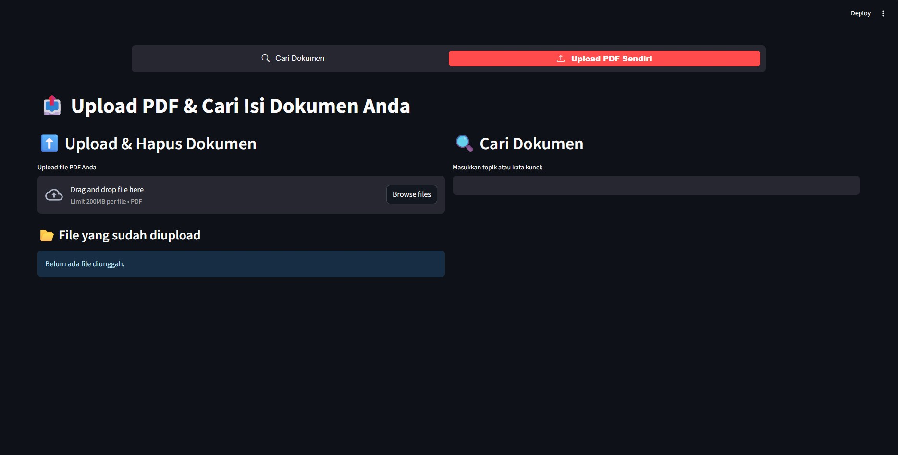

# 📚 AskMyPDF – Cari Isi Dokumen PDF Anda dengan Mudah

## 🎯 Masalah yang Saya Hadapi

Saya sering mengalami kesulitan mencari dokumen PDF yang saya simpan. Bukan karena filenya hilang, tapi karena saya **lupa nama file-nya**. Yang saya ingat biasanya adalah **isi atau topik** dari dokumen tersebut — tapi pencarian standar di komputer biasanya hanya bisa berdasarkan **nama file**, bukan **isi kontennya**.

Karena masalah kecil itu cukup mengganggu, saya putuskan untuk membuat solusi pribadi yang akhirnya menjadi aplikasi ini: **AskMyPDF**.

---

## 🚀 Apa Itu AskMyPDF?

**AskMyPDF** adalah aplikasi sederhana berbasis **Python** dan **Streamlit** yang memungkinkan Anda:

- 📤 Mengunggah file PDF pribadi
- 🔍 Mencari dokumen berdasarkan **isi teks di dalam PDF**, bukan hanya nama file
- 📖 Melihat pratinjau isi PDF langsung dari antarmuka aplikasi
- ⬇️ Mengunduh atau 🗑️ menghapus file yang sudah diunggah

---

## ⚙️ Teknologi yang Digunakan

- Python
- Streamlit – UI interaktif dan cepat
- PyMuPDF (fitz) – Ekstraksi teks dari file PDF
- **JSON indexing** – untuk menyimpan dan mencari isi dokumen secara efisien

---

## 💡 Manfaat Aplikasi

- Cocok digunakan siapa pun yang sering bekerja dengan banyak file PDF.
- Bisa diperluas ke solusi **AI/NLP** seperti **Retrieval-Augmented Generation (RAG)** agar bisa menjawab pertanyaan dari isi dokumen.
- Semua pemrosesan dilakukan **lokal**, jadi aman untuk dokumen pribadi.

---

## 🛠️ Cara Menjalankan

1. Clone repositori ini:

   ```bash
   git clone https://github.com/username/askmypdf.git
   cd askmypdf
   ```

2. Install depedensi:

   ```pip install -r requirements.txt```

3. Jalankan aplikasi:

   ```streamlit run main.py```

## 📂 Struktur Folder

```
    askmypdf/
    ├── data_pdf/        ← Contoh dokumen PDF
    ├── uploaded/        ← Folder penyimpanan upload user
    ├── index/           ← Menyimpan file index_document.json
    ├── engine/          ← Logika indexing dan pencarian
    ├── main.py          ← Aplikasi utama
    ├── app_index.py     ← Halaman pencarian dari data contoh
    ├── user_upload.py   ← Halaman upload & pencarian user
```

## 🤝 Ayo Gunakan dan Kembangkan

Silakan gunakan aplikasi ini untuk kebutuhan pribadi atau organisasi Anda.
Kalau ingin mengembangkan lebih jauh, silakan fork, tambahkan fitur, dan buat pull request! 🙌

## 📷 Cuplikan Aplikasi

Berikut tampilan aplikasi saat digunakan:



## 📬 Kontak

Jika ingin berdiskusi atau bekerja sama, jangan ragu hubungi saya di [LinkedIn](https://www.linkedin.com/in/arya-hisma-maulana).


